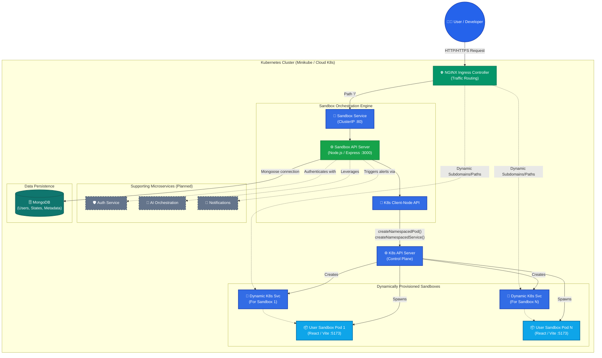
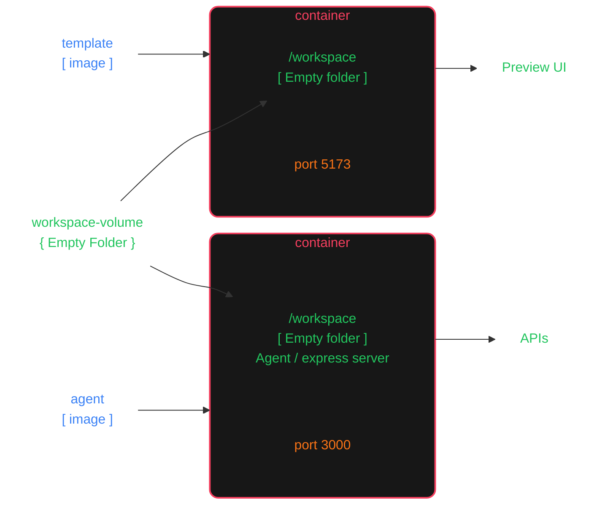
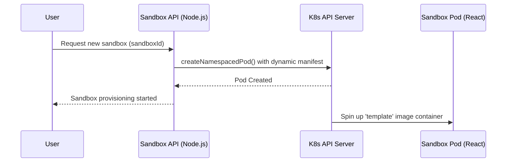

# Capstone Project Architecture


## 🏗️ Enterprise Architecture Diagram



## 📖 Overview
The Capstone Project is a scalable, microservices-based cloud platform designed to provide on-demand, sandboxed execution environments. Similar to cloud IDEs like CodeSandbox or Replit, it leverages **Kubernetes** to dynamically spin up isolated, containerized workspaces for users on the fly. 

The system currently features a backend orchestrator that talks directly to the Kubernetes API to manage the lifecycle of user environments based on a pre-configured React template.

---

## 🏗️ Architecture & Folder Structure

The repository is structured as a collection of microservices and infrastructure configurations:

```text
d:\Capstone
├── ai-orchestration/  # (Planned) AI-assisted orchestration capabilities
├── auth/              # (Planned) User authentication and authorization
├── notifications/     # (Planned) System notifications and real-time alerts
├── k8s/               # Kubernetes manifests for the main infrastructure
└── sandbox/           # The core sandboxing engine
    ├── server/        # Node.js API orchestrator
    └── template/      # React/Vite base image for user workspaces
```

### 1. Sandbox Service (Active)
This is the core engine of the platform, composed of the following components:

* **Backend Orchestrator (`sandbox/server`)**: A Node.js/Express application. It exposes health APIs and utilizes `@kubernetes/client-node` to interact directly with the K8s cluster. It dynamically constructs manifests and spawns isolated Pods for users on demand.
* **Base Template (`sandbox/template`)**: A React 19 application bundled with Vite. This acts as the user's workspace UI, exposing it on port `5173`.
* **Agent Server (`sandbox/agent`)**: An Express server running on port `3000` acting as a sidecar. It shares the same workspace volume as the template container, allowing it to inspect and manipulate user files (e.g., via APIs like `/list-files`).

#### Sandbox Pod Architecture (Sidecar Pattern)

To enable advanced features like an AI assistant or filesystem APIs, the dynamically provisioned Sandbox Pods use a **Multi-Container (Sidecar) Pattern**. Both the `template` and `agent` containers run in the same pod and share a common `emptyDir` volume mounted at `/workspace`. 



### 2. Infrastructure (`k8s`)
Contains the declarative YAML configurations to deploy the main Sandbox Orchestrator:
* **`rbac.yml`**: Sets up a Kubernetes ServiceAccount (`resourse-manager`), Role, and RoleBinding with permissions to manage `pods` and `services`. This grants the Node.js orchestrator the necessary authorization to dynamically spawn sandboxes within the cluster.
* **`sandbox-deployment.yml`**: Deploys the main orchestrator, explicitly assigning it the `resourse-manager` ServiceAccount. It uses the locally built template image (`imagePullPolicy: "Never"`), enforces strict resource limits (500m CPU, 400Mi RAM), and configures liveness/readiness probes targeting `/api/sandbox/health`.
* **`sandbox.service.yml`**: A `ClusterIP` service routing internal cluster traffic on port 80 to the deployment on port 3000.
* **`ingress.yml`**: An NGINX Ingress controller configuration routing root HTTP traffic (`/`) to the Sandbox service.

---

## 🚀 Dynamic Pod Provisioning Flow

The defining feature of this architecture is the programmatic creation of Kubernetes resources:



### Implementation Details:
* **`config.js`**: Initializes KubeConfig using the default service account or local `.kube/config`.
* **`pod.js`**: Contains the `createpod(sandboxId)` function which dynamically generates a Pod manifest with specific labels (`app: sandbox-{id}`) and hardware constraints.
* **`service.js`**: (Work In Progress) Intended to programmatically generate K8s Services to expose the newly created pods to the Ingress controller.

---

## 🛠️ Technologies Used

### Backend
* **Node.js & Express**: Core API framework.
* **Mongoose**: MongoDB object modeling (dependency included for future data persistence).
* **Kubernetes Client Node**: Programmatic K8s cluster management.

### Frontend (Template)
* **React 19 & Vite**: Fast, modern frontend architecture.
* **ESLint**: Enforced code quality.

### DevOps & Infrastructure
* **Docker**: Containerization of services.
* **Kubernetes**: Container orchestration, health monitoring, and scaling.
* **NGINX Ingress**: Routing and reverse proxying.

---

## ⚙️ Setup and Installation

### Prerequisites
* Node.js (v20+)
* Docker Desktop
* A local Kubernetes cluster (e.g., Minikube, Kind, or Docker Desktop K8s)
* `kubectl` CLI tool

### 1. Build the Base Docker Images

Before deploying, you must build the Docker images. **Crucially, the K8s cluster needs access to the `template` image to spawn sandboxes.**

```bash
# 1. Build the React Template Image
cd sandbox/template
docker build -t template:latest .

# Note: If you are using Minikube, you must load the image into its registry:
# minikube image load template:latest

# 2. Build the Sandbox Server Image
cd ../server
docker build -t sandbox:latest .
```

### 2. Deploy the Infrastructure

Apply the declarative manifests to your cluster:

```bash
cd ../../k8s
kubectl apply -f rbac.yml
kubectl apply -f sandbox-deployment.yml
kubectl apply -f sandbox.service.yml
kubectl apply -f ingress.yml
```

### 3. Verification

Check if the pods are running and healthy:
```bash
kubectl get pods
kubectl get services
```

---

## 📡 API Reference

| Endpoint | Method | Description |
| :--- | :--- | :--- |
| `/api/sandbox/health` | `GET` | Health check endpoint used by Kubernetes Liveness and Readiness probes. Returns a 200 status with a confirmation message. |

*(More endpoints to be added for sandbox creation and management)*

---

## 🔮 Future Roadmap

1. **Complete Dynamic Routing**: Finish `service.js` to create K8s Services dynamically and update Ingress rules so users can access their specific `sandboxId` environments via unique URLs.
2. **Implement Authentication (`auth`)**: Secure the API and manage user sessions/workspaces.
3. **Database Integration**: Utilize the installed Mongoose package to persist user data, sandbox states, and metadata.
4. **AI Orchestration (`ai-orchestration`)**: Introduce intelligent agents to assist users within their sandboxed environments.
5. **Real-time Notifications (`notifications`)**: Inform users via WebSockets when their sandboxes are ready or if errors occur.
